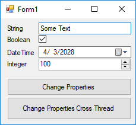

# DynamicObject Two-Way Data Binding
To create a Dynamic Object which you can use for two-way data-binding to Windows Forms control, you should derfive from `DynamicObject` and also implement `ICustomTypeDescriptor` and `INotifyPropertyChanged` interface.

`ICustomTypeDescriptor` is responsible to return metadata about the object including a list of properties. Since `DynamicObject` doesn't have real properties, you should return a list of custom `PropertyDescriptor` objects which allow the consumer to get/set value of the property.

`INotifyPropertyChanged` is responsible for raising `PropertyChanged` event. It's a key point in two-way data-binding.

In the example, I've craeted an implementation of the `DynamicObject` which you can simply add properties to it and use for two-wat data-binding in Windows Forms.

